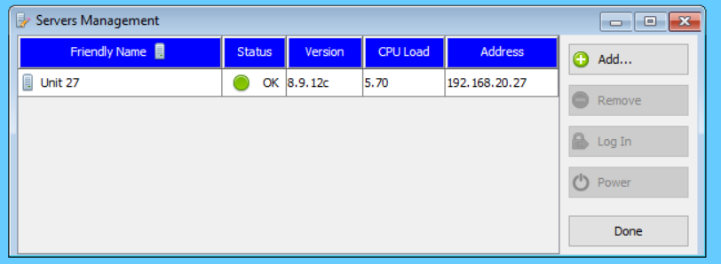

# Add a server to MissionView Display

Start with one of the add mechanisms. You may choose from the **Servers** menu

or the _Servers Management_ window's **Add...** button

Next, select your type from either NetAcquire Server or Quasonix RDMS, then fill in the hostname or IP address.

The server will then appear in the _Servers Management_ window.

You will now find a menu populated to your server where you can reach the configuration and status pages.

[Back to Learning Annex](./README.md)
