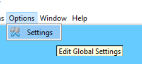
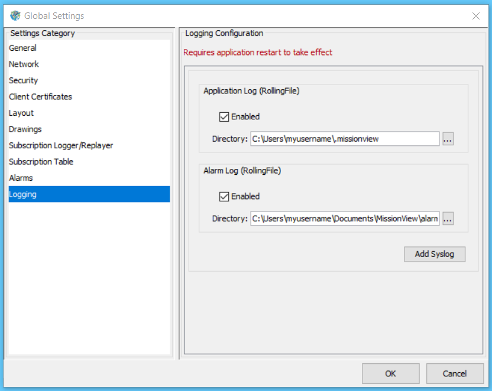
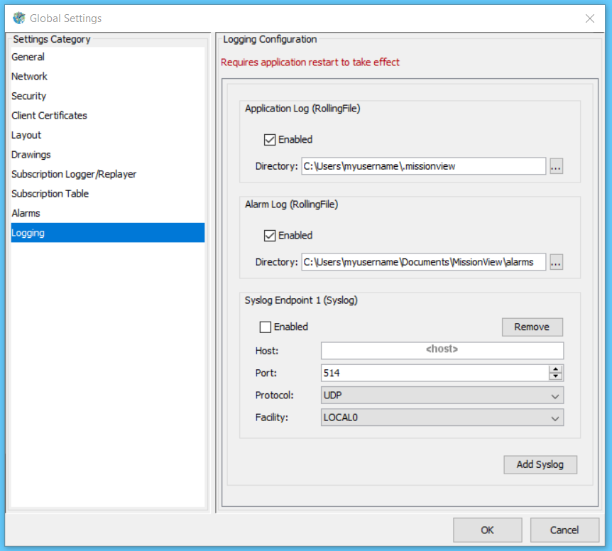

# Configuring Loggers

You can change the location of the application and alarms log files, or opt to send application log file out via [syslog](https://en.wikipedia.org/wiki/Syslog).

Start by opening **Settings** fom the **Options** menu.

Then select the Logging tab.

## Syslog

Click **Add Syslog** to configure a new syslog target.

- Configure the **Host** and the options specific to the targeted endpoint
- The Enabled checkbox turns each Syslog Endpoint on and off

[Back to Learning Annex](./README.md)
